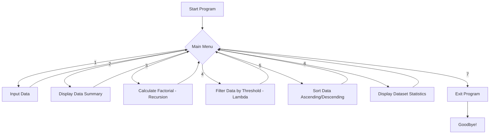

<div align="center">


</div>

---

## 📖 About The Project

**Functional Treat** is a menu-driven console application built in Python that acts as a **Data Analyzer and Transformer**. It works on one-dimensional (1D) arrays (Python lists) and demonstrates real-world usage of Python's function-related concepts — everything from simple built-in functions to recursion and lambda expressions.

This project was built as part of the **PR-4-Functions** assignment at **Red & White Skill Education** (BCA First Year, Computer Science & IT), and covers every required concept in a clean, interactive way.

<div align="center">

</div>

---

## ✨ Features

| # | Feature | Concept Demonstrated |
|---|----------|----------------------|
| 1️⃣ | **Input Data** | Accepts space-separated numbers and converts them into a list using type casting |
| 2️⃣ | **Display Data Summary** | Uses built-in functions like `len()`, `min()`, `max()`, `sum()` |
| 3️⃣ | **Calculate Factorial** | Demonstrates **recursion** with a clean base case and recursive call |
| 4️⃣ | **Filter Data by Threshold** | Uses a **lambda function** combined with `filter()` |
| 5️⃣ | **Sort Data** | Sorts data **ascending/descending** using `list.sort()` |
| 6️⃣ | **Dataset Statistics** | Returns **multiple values** (min, max, sum, average) from a single function |
| 7️⃣ | **Exit Program** | Gracefully ends the menu loop with `break` |

<div align="center">

</div>

---

## 🧠 Core Python Concepts Used

- ✅ **Built-in Functions** — `len()`, `sum()`, `min()`, `max()`
- ✅ **User-Defined Functions (UDF)** — separate function for each menu task
- ✅ **`global` Keyword** — `data` list is shared and modified across functions
- ✅ **Recursion** — factorial calculation (`factorial(n) = n * factorial(n-1)`)
- ✅ **Lambda Functions** — inline filtering logic (`lambda x: x >= threshold`)
- ✅ **`filter()` Function** — applies the lambda across the dataset
- ✅ **Returning Multiple Values** — dataset statistics function returns min, max, sum & average together
- ✅ **f-Strings** — clean, readable formatted output
- ✅ **`while True` Menu Loop** — continuous menu-driven interaction until exit

---

## 🔄 Program Flow



---

## 🎥 Video Explanation

<div align="center">

[](https://drive.google.com/file/d/1NFHbd3RouULT0r1KjjpqLQi1bHYzw8xK/view?usp=sharing)

*Click the badge above to watch a full walkthrough of the code, logic, and program flow.*

</div>

---

## 💻 Example Console Interaction

```
=== Welcome to Data Analyzer Program ===
1. Input Data
2. Display Data Summary
3. Calculate Factorial
4. Filter Data by Threshold
5. Sort Data
6. Display Dataset Statistics
7. Exit Program

Please enter your choice (1-7): 1
Enter numbers separated by spaces: 34 12 56 78 43 21 90
Data has been saved successfully!

Please enter your choice: 2
=== Data Summary ===
Total elements : 7
Minimum value  : 12
Maximum value  : 90
Sum of values  : 334
Average value  : 47.71

Please enter your choice: 3
Enter a number: 5
The factorial of 5 is: 120

Please enter your choice: 4
Enter threshold value: 50
Values greater than or equal to 50: [56, 78, 90]

Please enter your choice: 5
1. Ascending Order
2. Descending Order
Enter choice (1 or 2): 1
Sorted Data: [12, 21, 34, 43, 56, 78, 90]

Please enter your choice: 7
Thank you for using the program. Goodbye!
```

---

## 🚀 Getting Started

### Prerequisites
- Python 3.x installed on your system

### Installation & Run
```bash
# Clone the repository
git clone https://github.com/<your-username>/functional-treat.git

# Move into the project folder
cd functional-treat

# Run the program
python fb_py.py
```

<div align="center">

</div>

---

## 📂 Project Structure

```
functional-treat/
│
├── fb_py.py          # Main source code
├── README.md         # Project documentation (this file)
└── LICENSE            # License file
```

---

## 🧪 Assumptions Made

- The program handles a **1D list** of integers as the primary dataset.
- If the user tries to summarize, sort, filter, or analyze data before entering any, the program displays a friendly *"No data found!"* message instead of crashing.
- Sorting is done **in-place** using `list.sort()` for simplicity.
- Threshold filtering keeps values **greater than or equal to** the entered threshold.

---

## 🛣️ Future Improvements

- [ ] Add support for 2D array (nested list) operations
- [ ] Add `*args` and `**kwargs` demo functions explicitly
- [ ] Add Fibonacci sequence generator alongside factorial
- [ ] Add `__doc__` based in-menu help system
- [ ] Add unit tests for each function

---

## 🎉 Easter Egg

Type `42` anywhere the program doesn't expect it... just kidding, but hey — you read this far, so here's a virtual high-five! 🖐️

<div align="center">

</div>

---

## 👨‍💻 Author

<div align="center">

**Vatsal Vaghela**

📧 Email: [creativewithvaghela.vatsal@gmail.com](mailto:creativewithvaghela.vatsal@gmail.com)

[](https://www.linkedin.com/in/vatsal-v-9859a73a1/)

</div>

---

<div align="center">

### ⭐ If you found this project helpful, don't forget to give it a star!


</div>
